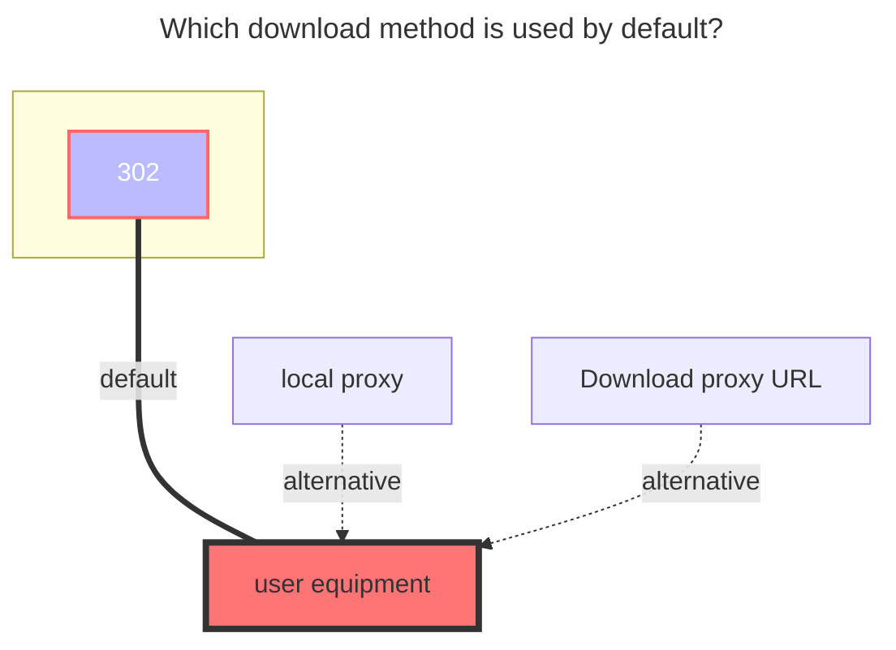

---
# This is the icon of the page
icon: iconfont icon-state
# This control sidebar order
order: 217
# A page can have multiple categories
category:
  - Guide
# A page can have multiple tags
tag:
  - Storage
  - Guide
  - "302"
# this page is sticky in article list
sticky: true
# this page will appear in starred articles
star: true
---
# SJTUNetdisk

**https://pan.sjtu.edu.cn**

:::tip

- SJTU Netdisk uses `302` redirect as the default download method.
- Login credentials may expire; use `Keep alive` to maintain the session.

:::

 

## **User token**

Open the developer debugging tool (F12) in your browser, switch to the **Network** tab and check **Disable cache**. After logging in to SJTU Netdisk, find the request that carries the authentication information, copy the `user_token` value and fill it in.

 

## **Keep alive**

When enabled, AList will periodically refresh the user token to keep the session alive, preventing the token from expiring after long periods of inactivity. Find the response header of the request that carries `Set-Cookie`, copy the `keepalive` value and fill it in.

 

## **User id**

Find the request that carries the `user ID` &mdash; it is located in the response body. Copy the `id` value and fill it in.

 

## **Order by**

Choose the field by which files and folders are sorted:

- `Name` &mdash; Sort by file/folder name
- `ModificationTime` &mdash; Sort by last modified time
- `Size` &mdash; Sort by file size

 

## **Order by type**

Choose the sort direction:

- `Asc` &mdash; Ascending order
- `Desc` &mdash; Descending order

 

### **The default download method used**

