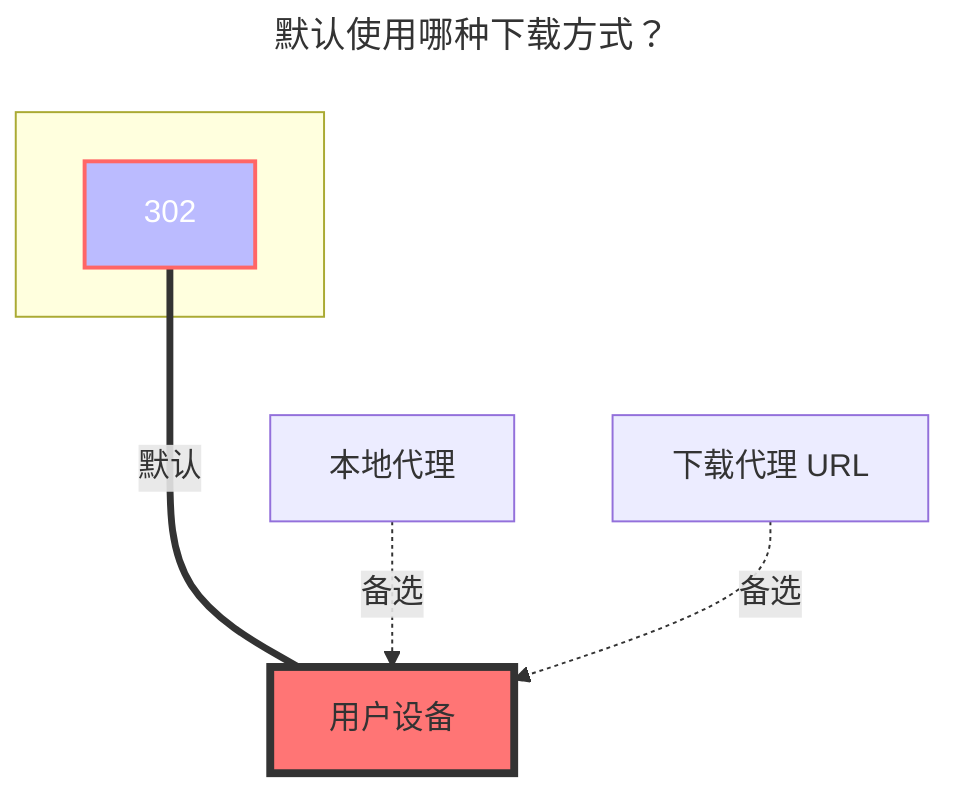

---
# This is the icon of the page
icon: iconfont icon-state
# This control sidebar order
order: 217
# A page can have multiple categories
category:
  - Guide
# A page can have multiple tags
tag:
  - Storage
  - Guide
  - "302"
# this page is sticky in article list
sticky: true
# this page will appear in starred articles
star: true
---
# 交大云盘

**https://pan.sjtu.edu.cn**

:::tip

- 交大云盘默认使用 `302` 重定向方式下载。
- 登录凭证可能会过期，建议开启 `Keep alive` 保持会话有效。

:::

 

## **User token（用户令牌）**

在浏览器中打开开发者调试工具（F12），切换到 **Network（网络）** 标签页并勾选 **Disable cache（禁用缓存）**。登录交大云盘后，找到携带认证信息的请求，复制 `user_token` 的值并填入。

 

## **Keep alive（保持活动状态）**

开启后，AList 会定期刷新用户令牌以保持会话有效，避免令牌在长时间不活跃后过期。找到携带 `Set-Cookie` 的请求的响应头，复制 `keepalive` 的值并填入。

 

## **User id（用户ID）**

找到携带 `user ID` 的请求 &mdash; 它位于响应体中。复制 `id` 的值并填入。

 

## **Order by（排序）**

选择文件和文件夹的排序依据：

- `名称` &mdash; 按文件/文件夹名称排序
- `修改时间` &mdash; 按最后修改时间排序
- `大小` &mdash; 按文件大小排序

 

## **Order by type（按类型排序）**

选择排序方向：

- `升序` &mdash; 升序
- `降序` &mdash; 降序

 

### **默认使用的下载方式**

